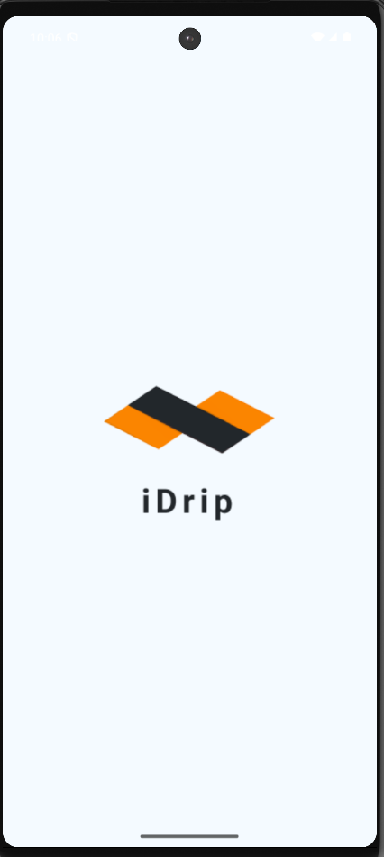
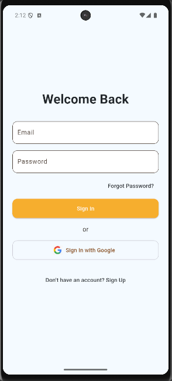
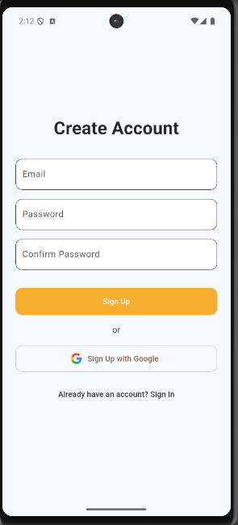
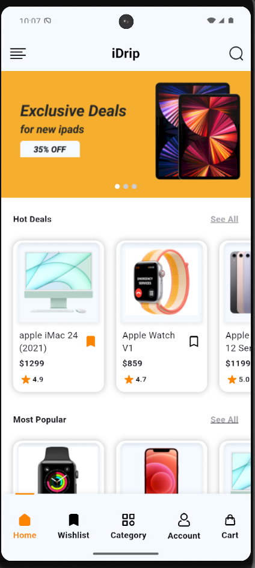
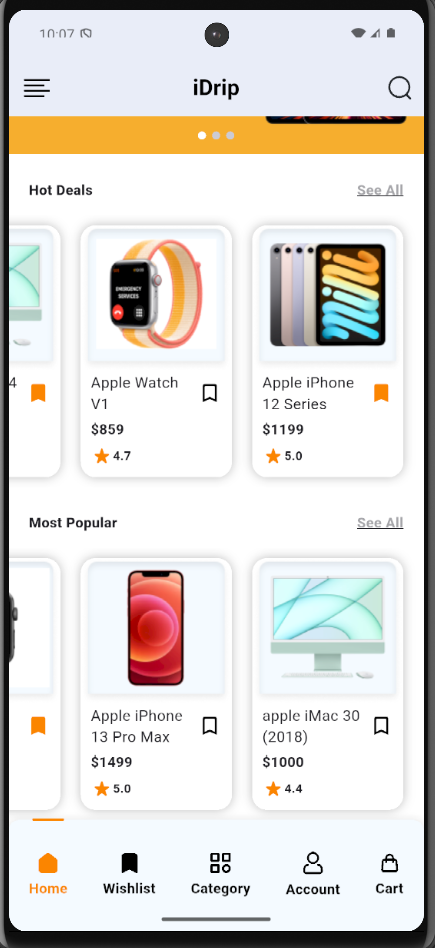
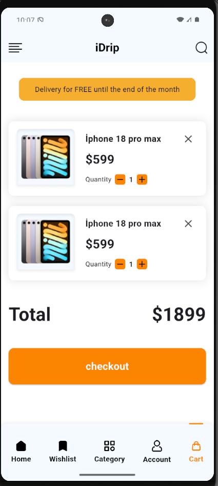

# 🛍️ E-Commerce App

This is a sample **e-commerce mobile application** built using **Flutter** and **Dart**. The app includes features like product listing, navigation between pages, and UI components like custom app bars, buttons, and a bottom navigation bar. It is designed for visual demonstration purposes and does not include backend functionality.

## 🧠 Technologies Used

- **Flutter** & **Dart**
- **Riverpod** for state management
- **Grock** for layout and navigation
- **Flutter SVG** for vector image rendering
- **Asset Generate** for automatic asset management (icons & images)

## 📸 Screenshots

### 👋 Splash


### 🔐 Sign In 


### 📝 Sign Up


### 🏠 Home 
 

### 🛒 Cart


## 🚀 Getting Started

To run this app on your local machine:

#### 1. Clone the repository
```markdown
git clone https://github.com/your-username/e-commerce-app.git
```
#### 2. Navigate into the project directory
```markdown
cd e-commerce-app
```
#### 3. Get dependencies
```markdown
flutter pub get
```
#### 4. Run the app
```markdown
flutter run
```
## License

[MIT](https://choosealicense.com/licenses/mit/)


